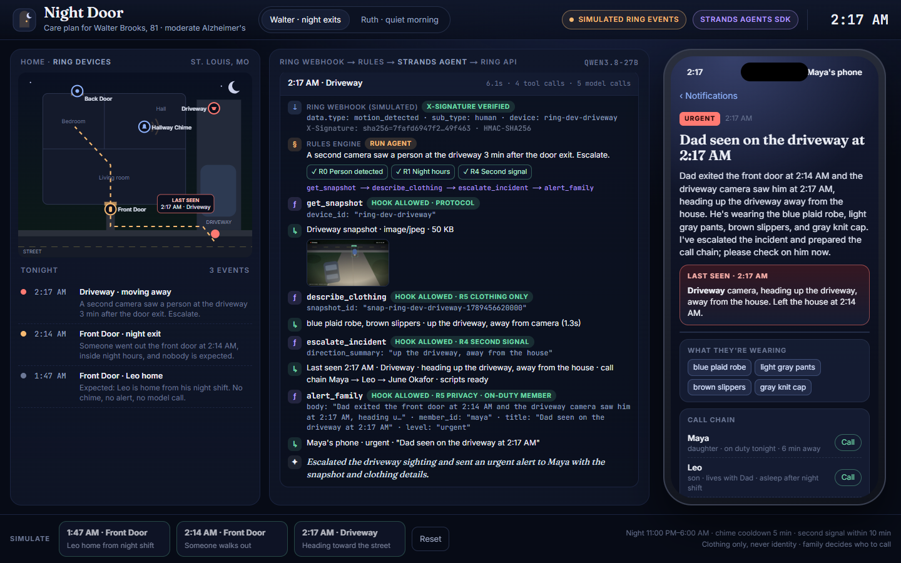
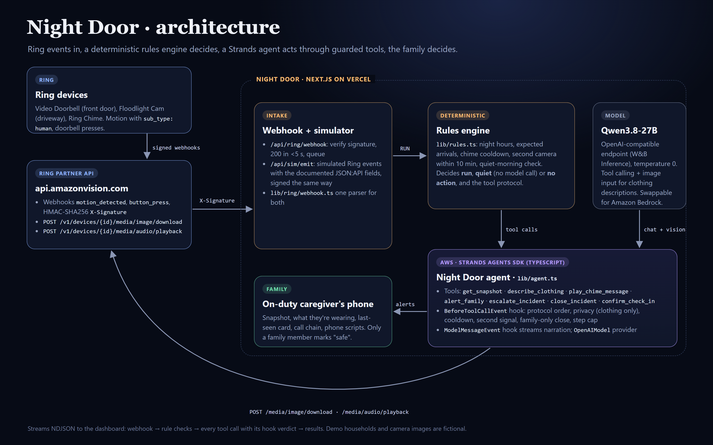

# Night Door

**Night Door is a Ring app for families caring for someone with dementia.** When a Ring camera sees a person leave the house in the middle of the night, a Strands agent plays a family member's calm, familiar voice on the Ring Chime, sends the on-duty caregiver the snapshot and exactly what the person is wearing, and, if a second camera sees them moving away, prepares a last-seen card, the call chain and a script for the phone. The family decides what happens next. For parents who live alone, the same care plan runs a gentle **Quiet Morning** check-in.

- **Live demo:** https://night-door.vercel.app (no login; uses clearly labeled simulated Ring events)
- **Pitch deck:** https://night-door.vercel.app/slides.html
- **Video:** coming with the Devpost submission



## The problem

- **6 in 10** people living with dementia will wander at least once, and many do so repeatedly. Wandering "can be dangerous, even life-threatening", and the stress of that risk weighs on caregivers. ([Alzheimer's Association: Wandering](https://www.alz.org/help-support/caregiving/stages-behaviors/wandering))
- An estimated **7.4 million** Americans aged 65 and older are living with Alzheimer's dementia, and **nearly 13 million** family members and friends provided **more than 19 billion hours** of unpaid care last year. ([Alzheimer's Association, 2026 Facts and Figures, Apr 21 2026](https://www.alz.org/news/2026/facts-figures-report-brain-health))
- The Alzheimer's Association recommends door chimes and monitoring devices that signal when doors open. But a plain door alarm only says *something opened*: it can't tell a son coming home from a night shift from Dad walking out at 2 AM, it wakes everyone for both, and it gives the person who has to act nothing to go on.

**Who it's for:** adult children and spouses caring for someone with dementia at home, often from across town, and home-care agencies covering many homes at night.

## Our solution

Night Door turns the Ring devices a family already owns into a care plan:

1. **Quiet by default.** Every Ring event arrives as a signed webhook. A deterministic rules engine checks the care plan: is it a person, is it night, is someone expected (Leo's shift ends at 1:30), did a chime just play? Expected arrivals and daytime motion never call a model and never notify anyone.
2. **A night exit gets a calm, instant response.** The Strands agent downloads the Ring snapshot, describes only clothing, carried items and direction (never faces, age, gender or identity), plays Maya's recorded voice on the Ring Chime ("Dad, it's Maya. It's the middle of the night. Let's head back inside"), and sends Maya one "please check" alert with the snapshot and what Dad is wearing.
3. **A second signal escalates.** If another camera sees a person within 10 minutes, the agent records a last-seen card (time, camera, heading, clothing), orders the call chain and prepares a non-emergency script plus a 911 script for later. **Night Door never calls anyone by itself.**
4. **Only a family member closes it.** Maya taps "safe"; the agent writes a care-log note with a follow-up.
5. **Quiet Morning** for people who live alone: no door activity by 10:00 AM → Sam's voice asks Grandma through the kitchen chime to press the doorbell; her press closes the loop with an "all good".

What people still decide: whether it's a real emergency, who to call, and when it's over.

## How we use Amazon's tech

### Ring (track technology)

Night Door is built against the **Ring Partner API** (`https://api.amazonvision.com`) as documented at developer.amazon.com/docs/ring/api-documentation.html:

| Ring capability | Where | Used for |
| --- | --- | --- |
| Webhooks `motion_detected` (with `sub_type`) and `button_press`, JSON:API payload | `lib/ring/webhook.ts`, `app/api/ring/webhook/route.ts` | Every trigger. Zod-validated, normalized to one event type |
| `X-Signature: sha256=` HMAC-SHA256 of the raw body | `lib/ring/signature.ts` | Rejects forged or tampered events (timing-safe compare); duplicate `request_id`s are dropped |
| `POST /v1/devices/{device_id}/media/image/download` | `lib/ring/client.ts` → `get_snapshot` tool | Snapshot for the family alert and the clothing description |
| `POST /v1/devices/{device_id}/media/audio/playback` (Ring Chime) | `lib/ring/client.ts` → `play_chime_message` tool | The familiar recorded voice. It is the only write action Ring exposes, and it's the heart of the product |
| `GET /v1/devices?include=status,capabilities`, `GET /v1/history/devices/{id}/events` | `lib/ring/client.ts`, `app/api/ring/devices/route.ts` | Live-mode device mapping and inspection |
| OAuth refresh (`oauth.ring.com/oauth/token`) or Developer Playground token, 429 `Retry-After` handling | `lib/ring/client.ts` | Auth and rate limits |

**Simulator mode (what the demo runs today).** We don't own Ring hardware and built this before creating a Ring developer account, so `RING_MODE=simulator` (the default) uses a built-in simulator: `app/api/sim/emit/route.ts` builds webhook bodies with exactly the documented field names and signs them with the same HMAC key, and they go through the **same** verification and parsing code as real webhooks. Snapshots are original illustrations (`scenes/`). The UI shows a **"Simulated Ring events"** badge the whole time. Setting `RING_MODE=live` switches the same app to the real API; the steps to re-record against Ring's Developer Playground are in [`docs/ring-live-checklist.md`](docs/ring-live-checklist.md). Everything we tripped over is in [`FRICTION_LOG.md`](FRICTION_LOG.md).

The app follows the Ring Appstore UX guide: a web experience, WCAG 2.2 AA-minded (keyboard focus, labels, text next to every color, reduced-motion support), no routine notifications, no Ring branding.

### AWS: Strands Agents SDK

The agent is built with the **Strands Agents SDK for TypeScript** (`@strands-agents/sdk`) in [`lib/agent.ts`](lib/agent.ts), running inside a Next.js route handler (`app/api/agent/route.ts`) that streams every step to the dashboard as NDJSON.

- **`Agent` + 7 `tool()`s with Zod schemas:** `get_snapshot`, `describe_clothing`, `play_chime_message`, `alert_family`, `escalate_incident`, `close_incident`, `confirm_check_in`.
- **`BeforeToolCallEvent` hook = the care plan in code.** Each call is checked before it runs: only tools in this event's protocol, in order, once each; chime cooldown (R3); escalation only on a second camera signal within 10 minutes (R4); privacy (R5, alert text mentioning age, gender, ethnicity, face and similar traits is blocked); alerts only to the on-duty family member at the level the rules chose; only a family confirmation can close an incident (R7); a 12-call step cap. Blocked calls set `event.cancel` with a reason the model sees and can correct. Every verdict is shown in the UI.
- **`ModelMessageEvent` hook** streams the agent's own summary to the feed.
- **`OpenAIModel` provider** with `temperature: 0` and thinking disabled for fast, repeatable runs (Qwen3.8-27B on an OpenAI-compatible endpoint, including image input for clothing descriptions). Strands is model-agnostic, so moving to Amazon Bedrock is a provider swap with the same tools and hooks. We did not use paid AWS services or deploy to AgentCore.
- **Determinism first:** `lib/rules.ts` decides whether an agent runs at all and which protocol it follows; quiet events cost zero model calls. Scripts, call chains and last-seen cards are assembled in code from verified data, so the model can't invent a time or a camera.

## Architecture



Source: [`docs/architecture.html`](docs/architecture.html) (render with `node scripts/render-assets.mjs`).

## Try it

Open the live demo. On **Walter · night exits**, click the buttons along the bottom in order:

1. **1:47 AM · Front Door**: Leo comes home. The rules engine stays quiet (no model call).
2. **2:14 AM · Front Door**: someone walks out. Watch the webhook verify, the rule chips pass, each Strands tool call pass its hook, the snapshot and clothing appear, the chime message play, and Maya's phone light up.
3. **2:17 AM · Driveway**: escalation, last-seen card, call chain and scripts on Maya's phone (scroll the phone).
4. On the phone, tap **Found him. He's safe**.

Then switch to **Ruth · quiet morning** and run the two steps. **Reset** starts over. A run takes about 3–8 seconds.

## Run locally

Requirements: Node 22+ and pnpm.

```bash
pnpm install
cp .env.example .env.local   # set OPENAI_BASE_URL / OPENAI_API_KEY / OPENAI_MODEL (any OpenAI-compatible endpoint with tool calling + image input)
pnpm build && pnpm start     # http://localhost:3000
```

- `RING_MODE=simulator` (default) needs nothing else. For live Ring, follow [`docs/ring-live-checklist.md`](docs/ring-live-checklist.md).
- `node scripts/render-assets.mjs` re-renders the simulator images and the architecture diagram (uses Playwright with local Chrome).
- Demo state lives in the browser and is sent with each request; there is no database. The agent route has a per-IP rate limit (in-memory, per server instance) and a step cap.

## Honest notes

- New work, built during the hackathon window (which started Aug 31, 2026).
- All households, names, phone numbers (555-01xx) and camera images are **fictional**. Ring events in the demo are **simulated** (see above).
- The chime messages are represented as text; a real deployment needs the family's recorded audio in a Chime audio slot (see FRICTION_LOG #1).
- Claude Code was used as a coding assistant. Demo video narration is synthetic (ElevenLabs).

## License

[AGPL-3.0](LICENSE). Commercial licences are available from the author. The Night Door name and logo are not covered by the licence — see [TRADEMARKS.md](TRADEMARKS.md).
